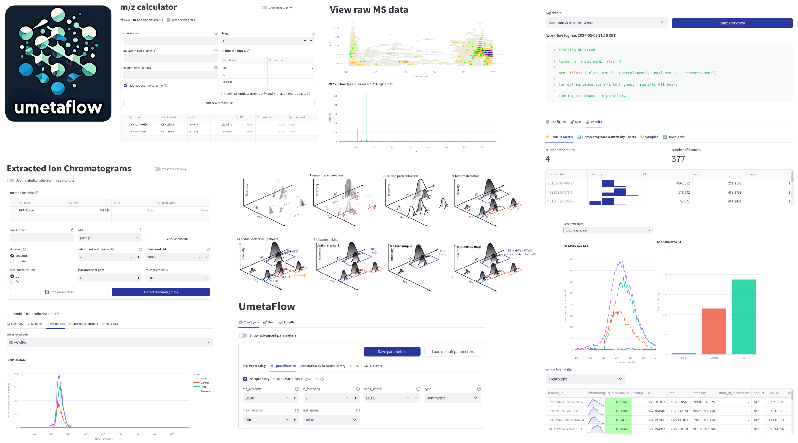

[**Click to open app!**](https://abi-services.cs.uni-tuebingen.de/umetaflow)

## What is UmetaFlow?

This app offers the powerful UmetaFlow **[1]** pipeline for untargeted metabolomics in an accessible user interface. Raw data pre-processing converts raw data to a feature quantification table by feature detection, alignment, grouping, adduct annotation and optional re-quantification of missing values. Features can be annotated by in-house libraries based on MS1 m/z and retention time matching as well as MS2 fragment spectrum similarity as well as with formula, structure and compound classes by SIRIUS. Furthermore, required input files for GNPS Feature Based Molecular Networking can be generated. Besides the untargeted pipeline, this app offers some additional features, such as an interface to explore raw data and metabolite identification and quantification via extracted ion chromatograms based on exact m/z values generated conveniently by an included m/z calculator. For downstream processing statistical analysis can be performed within the app or in the popular [FBmn STATS GUIde](https://github.com/axelwalter/streamlit-metabolomics-statistics) for statistical analyis of metabolomics data **[2]**.

**[1]** Kontou, Eftychia E., et al. "UmetaFlow: an untargeted metabolomics workflow for high-throughput data processing and analysis." Journal of Cheminformatics 15.1 (2023): 52**.

**[2]** Shah, Abzer K. Pakkir, et al. "The Hitchhiker’s Guide to Statistical Analysis of Feature-based Molecular Networks from Non-Targeted Metabolomics Data." (2023).

UmetaFlow is further implemented as a [snakemake pipeline](https://github.com/NBChub/snakemake-UmetaFlow) and as a Python version in [Jupyter notebooks](https://github.com/eeko-kon/pyOpenMS_UmetaFlow) based on [pyOpenMS](https://pyopenms.readthedocs.io/en/latest/index.html).

## Installation
1. Clone this repository

`git clone https://github.com/axelwalter/umetaflow-gui.git`

2. Change into the `umetaflow-gui` folder

`cd umetaflow-gui`

3. Install all Python modules specified in the requirements file with pip

`pip install -r requirements.txt`

**or** create a conda environment and activate it

`conda env create -f environment.yml`

`conda activate umetaflow-gui`

4. Launch the streamlit app locally in your browser

`streamlit run Home.py local`

### Windows
1. Visit the [UmetaFlow web app](https://abi-services.cs.uni-tuebingen.de/umetaflow/)
2. Click on **Download for Windows** button and download zip file
3. Extract zip file
4. Run the app by executing `UmetaFlow`

## Quickstart

### Workspaces
On the left side of this page you can define a workspace where all your data including uploaded `mzML` files will be stored. Entering a workspace will switch to an existing one or create a new one if it does not exist yet. In the web app, you can share your results via the unique workspace ID. Be careful with sensitive data, anyone with access to this ID can view your data.

### 📁 File Handling
Upload `mzML` files via the **File Upload** tab. The data will be stored in your workspace. With the web app you can upload only one file at a time.
Locally there is no limit in files. However, it is recommended to upload large number of files by specifying the path to a directory containing the files.

Your uploaded files will be shown in the sidebar of all tabs dealing with the files, e.g. the **Metabolomics** tab. Checked file names will be used for analysis.

Result files are available via specified download buttons or, if run locally, within the workspace directory.
### Workflows

#### 📟 m/z Calculator

The m/z calculator facilitates the calculation of mass-to-charge ratios (m/z) for metabolites and includes a method to easily combine metabolites into large molecules.

This table can be used as input for the Extracted Ion Chromatograms workflow.

#### 🔍 Extracted Ion Chromatograms

Simple workflow for the extraction of chromatograms by `m/z` (and optionally `RT` range) value. Produces a **Feature Matrix** file with area under the curve intensities as well as a **Meta Data** template and the chromatogram data for each file.

Area intensities of different variants (e.g. adducts or neutral losses) of a metabolite can be combined. Put a `#` with the name first and variant second (e.g. `glucose` and `glucose#[M+Na]+`).  

#### 🧪 Metabolomics (UmetaFlow)

The core UmetaFlow pipeline with some tweaks.

1. **Pre-Processing**
Converting your raw data to a table of metabolic features with a series of algorithms. Produces a table of consensus metabolite intensities across your samples.

2. **Re-Quantification**
One of the unique and great features of UmetaFlow. For missing value imputation go back into the raw data and double check. Never miss a feature any more! 

3. **GNPS and SIRIUS**
Export all files required to run GNPS Feature Based Molecular Networking and SIRIUS externally. Also offers the possibility to annotate from the complete GNPS library. For manual annotation of SIRIUS results a unique ID is provied in the **Feature Matrix**.

4. **Annotation via in-house libraries**
Load your in-house data for MS1 (`tsv` file with metabolite `m/z` and `RT` values) and MS2 (`mgf` file) annotations.

#### 📈 Statistics
Here, you can do basic statistics right away such as calculating mean intensities, fold changes, clustering and heatmaps all with nice visualizations.

For an advanced and complete workflow visit the [app for statistical analysis of metabolomics data](https://axelwalter-streamlit-metabol-statistics-for-metabolomics-3ornhb.streamlit.app/).
